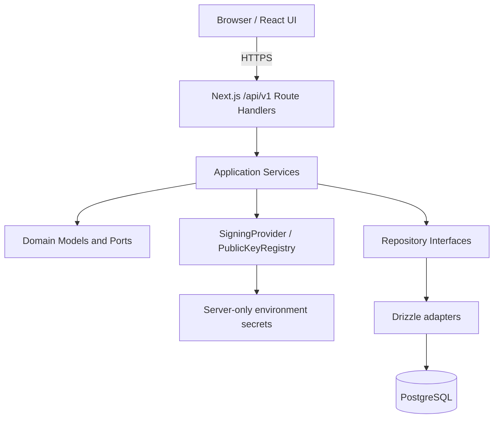

# NuProof Lab

NuProof Lab is an independent technical Proof of Concept for cryptographically
verifiable bank receipts. It is not affiliated with, endorsed by, or operated by
Nu. All people, accounts and transactions are fictitious.

## Problem

Screenshots and visual receipts can be edited. A legitimate QR can also be copied
onto a false document. Neither a polished image nor a QR is proof by itself.

## Solution

```text
Bank transaction
      |
      v
Canonical receipt + SHA-256 + Ed25519
      |
      v
QR verification URL
      |
      v
Versioned verification API
      |
      v
Authenticity + historical status + current status
```

NuProof keeps the signed state at issuance separate from the current transaction
state. A later reversal therefore returns an authentic receipt with
`statusAtIssuance=SETTLED` and `currentStatus=REVERSED`.

## Tech stack

- Next.js 16 App Router, React 19 and strict TypeScript
- Tailwind CSS 4
- PostgreSQL 17 and Drizzle ORM
- Ed25519 signatures and SHA-256 payload hashes
- HMAC-SHA-256 verification-token digests
- Zod HTTP validation, Vitest and Playwright

## Architecture



The UI and API currently deploy together as one Next.js application. Business
logic does not live in React or Route Handlers, so `src/domain`,
`src/application` and backend adapters can later move to an API service.

## Local development

Requirements: Node.js 22, npm and Docker Desktop.

```bash
npm install
docker compose up -d
npm run keys:generate
```

Create `.env.local` from `.env.example`, then copy the four generated
`NUPROOF_*` lines from `.env.keys`. Do not commit either file.

```bash
npm run db:migrate
npm run db:seed
npm run dev
```

Open `http://localhost:3000`. The demo seed is deliberately blocked unless
`DEMO_MODE=true`.

## Money convention

`amountMinor` is always an integer number of currency minor units. For COP this
PoC uses two minor units per peso: `25_000_000` represents `$250.000 COP`. The UI
formats values; financial values are never calculated with floating point.

## Security model

- The server builds a versioned canonical receipt payload.
- SHA-256 detects stored-payload changes and Ed25519 proves issuer signing.
- The private PKCS#8 key is server-only and never enters HTML, JSON, QR or client
  JavaScript.
- PostgreSQL stores only an HMAC digest of the random 256-bit verification token.
- A receipt stores `keyId`; the public registry can retain multiple rotated keys.
- The QR contains only a bearer verification URL, not complete banking data.
- Public verification responses follow data minimization.

See [CRYPTOGRAPHY.md](docs/CRYPTOGRAPHY.md) and
[THREAT_MODEL.md](docs/THREAT_MODEL.md).

## Fraud simulations

`/security-lab` executes real API and cryptographic paths for:

- protected amount manipulation;
- a valid QR copied onto a false amount;
- invented receipt ID;
- invalid verification token;
- transaction reversal.

The security test suite also mutates the persisted receipt amount and proves that
verification returns `INVALID_SIGNATURE`.

## Testing

```bash
npm run typecheck
npm run lint
npm test
npm run build
npm run test:e2e
```

`tests/unit`, `tests/integration` and `tests/security` run without a shared
database. Playwright requires the local PostgreSQL setup.

## Vercel deployment

Create one Vercel project at the repository root with framework preset
**Next.js**. Do not set an Output Directory and do not select `apps/mobile` or
`apps/server`.

Set these server environment variables:

- `DATABASE_URL`: managed PostgreSQL URL, including the provider-required TLS
  mode such as `sslmode=require`;
- `NUPROOF_PRIVATE_KEY`: base64 PKCS#8 private key;
- `NUPROOF_PUBLIC_KEYS_JSON`: JSON public-key registry;
- `NUPROOF_KEY_ID`: active signing key ID;
- `NUPROOF_TOKEN_PEPPER`: random secret of at least 32 characters;
- `APP_URL`: canonical HTTPS deployment URL;
- `DEMO_MODE`: `true` only for this public PoC;
- `INTERNAL_API_KEY`: random issuer API credential for non-browser clients.

Apply migrations explicitly against the managed database before deployment:

```bash
DATABASE_URL="..." npm run db:migrate
DATABASE_URL="..." npm run db:seed
```

The Vercel build never runs migrations, seeds data or generates keys.
