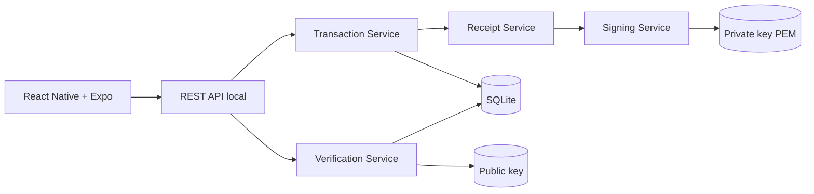

# NuProof Lab

**Proof of Concept independiente. No afiliado a Nu.** Todos los nombres,
operaciones y cuentas enmascaradas son ficticios. No use información bancaria
real.

## Problema

Una imagen de un comprobante puede editarse sin dejar señales evidentes. Un QR
también puede copiarse desde un comprobante legítimo. Confiar en la apariencia de
una captura no demuestra quién la emitió ni cuál es el estado actual del pago.

## Solución propuesta

NuProof Lab crea un snapshot explícito, lo serializa de forma determinista,
calcula SHA-256 y lo firma con Ed25519 en un servidor local. El QR v2 contiene
ese snapshot enmascarado, firma, hash, `keyId` y un token aleatorio. La app
valida localmente la prueba y consulta por separado el estado actual cuando la
API está disponible.

## Arquitectura



La clave privada se genera una vez en `apps/server/data/keys`, está ignorada por
Git y nunca cruza la API. Consulte [Architecture](docs/ARCHITECTURE.md),
[Threat Model](docs/THREAT_MODEL.md) y
[Production Architecture](docs/PRODUCTION_ARCHITECTURE.md).

## Flujo criptográfico

```text
transaction -> canonical JSON -> SHA-256 -> Ed25519 signature -> receipt -> QR
QR -> local Ed25519 verification -> optional API lookup -> current status
```

El snapshot firmado incluye importe, moneda, timestamp, destino enmascarado,
referencia, estado emitido y `keyId`. La reversión cambia solo el estado actual.
El hash ayuda a inspeccionar; no sustituye la firma.

## Estructura

```text
apps/
  mobile/                 Expo Router, NativeWind, camera y QR
  server/                 Express, node:sqlite y node:crypto
packages/
  shared/                 Schemas Zod y contratos TypeScript
docs/
  ARCHITECTURE.md
  PRODUCTION_ARCHITECTURE.md
  THREAT_MODEL.md
```

## Requisitos

- Node.js 22.5 o superior (`node:sqlite` está disponible desde esa línea)
- npm 10 o superior
- Expo Go compatible con SDK 57, emulador Android o simulador iOS
- Teléfono y computador en la misma red para una demo física

## Instalación y backend

```bash
npm install
cp .env.example .env
npm run build
npm run dev:server
```

En PowerShell use `Copy-Item .env.example .env`. La API escucha por defecto en
`0.0.0.0:3000`, crea las claves/BD y carga cuatro fixtures. Compruebe:

```bash
curl http://localhost:3000/api/health
```

## React Native

En otra terminal:

```bash
npm run dev:mobile
```

Configuración de URL:

- Android Emulator: `EXPO_PUBLIC_API_URL=http://10.0.2.2:3000`
- iOS Simulator: `EXPO_PUBLIC_API_URL=http://localhost:3000`
- Dispositivo físico: `EXPO_PUBLIC_API_URL=http://IP_DEL_PC:3000`

En PowerShell puede identificar la IPv4 local con `Get-NetIPAddress
-AddressFamily IPv4`. Elija la interfaz Wi-Fi activa, configure la variable antes
de iniciar Expo y permita el puerto 3000 en el firewall solo para la red privada.
El móvil y el PC deben estar en la misma red. Ejemplo:

```powershell
$env:EXPO_PUBLIC_API_URL="http://192.168.1.25:3000"
npm run dev:mobile
```

`EXPO_PUBLIC_NUPROOF_ED25519_PUBLIC_KEY` fija la clave pública confiable para
`nuproof-dev-key-2026-01`. Es pública y puede configurarse en Vercel. Debe
actualizarse junto con `keyId` cuando se roten las claves. Nunca configure una
clave tomada del propio QR como clave confiable.

iOS Simulator requiere macOS. Expo Go permite probar iOS físico cuando la
versión instalada admite SDK 57.

## API

| Método | Endpoint | Uso |
| --- | --- | --- |
| `GET` | `/api/health` | Salud |
| `GET` | `/api/security/public-key` | Clave pública Ed25519 |
| `GET` / `POST` | `/api/transactions` | Listar / crear |
| `GET` | `/api/transactions/:id` | Comprobante del emisor |
| `POST` | `/api/verify` | Verificación pública |
| `POST` | `/api/transactions/:id/reverse` | Reversión demo |
| `POST` | `/api/lab/verify-tampered` | Prueba criptográfica controlada |
| `GET` | `/api/audit` | Auditoría demo |
| `POST` | `/api/demo/reset` | Restaurar fixtures, conservar claves |

## Pruebas

```bash
npm test
npm run typecheck
npm run lint
```

La suite cubre canonicalización, firma válida, cambio de importe/destino/fecha,
clave incorrecta, ID/token inválidos, reversión, API, alteración directa de
SQLite y verificación portable sin servidor. El caso obligatorio firma
`100000`, sustituye por `8000000`, recalcula incluso el hash y exige una firma
inválida.

## Guion de fraude

1. Abra **Issuer Simulator**, cree `$250.000` para `Laura Gómez`, `**** 5832`.
2. Abra el comprobante y escanee su QR desde otro dispositivo.
3. Confirme el resultado verde y los datos originales.
4. En **Security Lab**, ejecute **Modificar valor**. El servidor reconstruye el
   payload alterado y Ed25519 responde `INVALID_SIGNATURE`.
5. Ejecute **Copiar QR verdadero**. El QR pegado sobre el documento falso
   recupera el importe original, no el dibujado.
6. Ejecute **ID inventado** y observe `NOT_FOUND`.
7. Ejecute **Reversar transacción**. La firma sigue válida, pero el estado aparece
   en amarillo como `REVERSED`.
8. Use **Reset demo** para repetir. Las claves no se regeneran.

Un QR v2 nuevo puede escanearse desde la versión web publicada en Vercel aunque
el servidor local esté apagado. En ese caso se muestra firma e integridad
válidas junto a la advertencia **Estado actual no disponible**. Los QR v1
generados antes de esta versión deben volver a mostrarse/generarse para incluir
la prueba portable.

En builds públicas sin `EXPO_PUBLIC_API_URL`, la app no consulta el `localhost`
del visitante. La búsqueda de estado se habilita únicamente en desarrollo o
cuando se configura explícitamente una API pública.

## Decisiones de seguridad

- Importes enteros; nunca `float`.
- Inputs y QR con esquemas estrictos y rechazo de campos inesperados.
- UUID aleatorios y tokens generados con CSPRNG.
- Comparación de token con tiempo constante.
- Respuesta pública minimizada y auditoría sin secretos.
- Rate limiting local sobre verificación.
- Estado histórico inmutable separado del estado operativo actual.

## Limitaciones

`node:sqlite` continúa marcado experimental en Node 22. La clave PEM, SQLite,
auditoría mutable, rate limiter en memoria y simulador sin autenticación son
simplificaciones explícitas para ejecución local. La lista interna de
comprobantes expone tokens a la app del emisor y no debe ser una API pública.

Producción requiere HSM/KMS, key rotation formal, IAM, mTLS, OAuth2, WAF, SIEM,
logs inmutables, almacenamiento altamente disponible, secrets manager, tracing,
disaster recovery y separación real del signing service.

## Siguientes iteraciones

- Registro versionado de claves públicas y rotación.
- Autenticación/roles del emisor y separación de superficies.
- Pruebas E2E de cámara en dispositivos y accesibilidad automatizada.
- Recibos descargables que incorporen el payload firmado y protección anti-downgrade.
- Idempotencia y conciliación con un core transaccional simulado.
