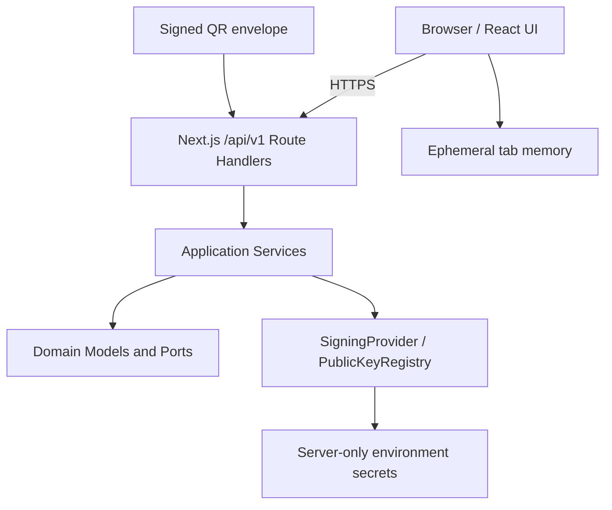

# NuProof Lab

NuProof Lab is an independent technical Proof of Concept for cryptographically
verifiable bank receipts. It is not affiliated with, endorsed by, or operated by
Nu. All people, accounts and transactions are fictitious.

## Problem

Screenshots and visual receipts can be edited. A legitimate QR can also be copied
onto a false document. Neither a polished image nor a QR is proof by itself.

## Solution

```text
Bank transaction
      |
      v
Canonical receipt + SHA-256 + Ed25519
      |
      v
QR verification URL
      |
      v
Versioned verification API
      |
      v
Authenticity + historical status + current status
```

This PoC is stateless. The QR transports a self-contained signed envelope and
the API verifies it without storing transactions or receipts. A reversal in the
Security Lab is a browser-session simulation and disappears on reload.

## Tech stack

- Next.js 16 App Router, React 19 and strict TypeScript
- Tailwind CSS 4
- Ed25519 signatures and SHA-256 payload hashes
- Zod HTTP validation, Vitest and Playwright

## Architecture



The UI and API currently deploy together as one Next.js application. Business
logic does not live in React or Route Handlers, so `src/domain`,
`src/application` and backend adapters can later move to an API service.

## Local development

Requirements: Node.js 22 and npm.

```bash
npm install
npm run keys:generate
```

Create `.env.local` from `.env.example`, then copy the three generated
`NUPROOF_*` lines from `.env.keys`. Do not commit either file.

```bash
npm run dev
```

Open `http://localhost:3000`. The demo seed is deliberately blocked unless
`DEMO_MODE=true`.

## Money convention

`amountMinor` is always an integer number of currency minor units. For COP this
PoC uses two minor units per peso: `25_000_000` represents `$250.000 COP`. The UI
formats values; financial values are never calculated with floating point.

## Security model

- The server builds a versioned canonical receipt payload.
- SHA-256 detects payload changes and Ed25519 proves issuer signing.
- The private PKCS#8 key is server-only and never enters HTML, JSON, QR or client
  JavaScript.
- A receipt stores `keyId`; the public registry can retain multiple rotated keys.
- The QR contains a signed evidence envelope after `#`, so it is not included
  in HTTP access logs.
- Public verification responses follow data minimization.

See [CRYPTOGRAPHY.md](docs/CRYPTOGRAPHY.md) and
[THREAT_MODEL.md](docs/THREAT_MODEL.md).

## Fraud simulations

`/security-lab` executes real API and cryptographic paths for:

- protected amount manipulation;
- a valid QR copied onto a false amount;
- invented receipt ID;
- invalid verification token;
- transaction reversal.

The Security Lab presents a modified amount and proves that verification returns
`INVALID_SIGNATURE`.

## Testing

```bash
npm run typecheck
npm run lint
npm test
npm run build
npm run test:e2e
```

The PoC does not require a database. Transaction history and audit events exist
only in the current browser module session and disappear on reload or redeploy.

## Vercel deployment

Create one Vercel project at the repository root with framework preset
**Next.js**. Do not set an Output Directory and do not select `apps/mobile` or
`apps/server`.

Set these server environment variables:

- `NUPROOF_PRIVATE_KEY`: base64 PKCS#8 private key;
- `NUPROOF_PUBLIC_KEYS_JSON`: JSON public-key registry;
- `NUPROOF_KEY_ID`: active signing key ID;
- `APP_URL`: canonical HTTPS deployment URL;
- `DEMO_MODE`: `true` only for this public PoC;
- `INTERNAL_API_KEY`: random issuer API credential for non-browser clients.

On Vercel, enable **Automatically expose System Environment Variables**. The
application uses `VERCEL_PROJECT_PRODUCTION_URL` as the canonical QR origin and
the current deployment host for same-origin Preview requests. Configure
`DEMO_MODE=true` for every Vercel environment where `/issuer` and
`/security-lab` must be interactive; environment changes require a new
deployment. No `DATABASE_URL`, migration or database integration is required.
