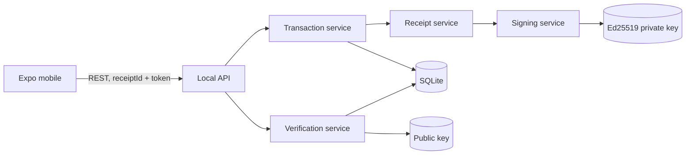

# Arquitectura de NuProof Lab

NuProof Lab es una prueba de concepto independiente y no afiliada a Nu. Todos los
datos son ficticios. El sistema se ejecuta localmente y separa la experiencia
móvil de la autoridad que firma.

## Límites del sistema

La clave privada solo existe en `apps/server/data/keys`, ignorada por Git. El
móvil jamás recibe esa clave. La API pública expone únicamente la clave pública.

## Modelo de datos

- `transactions`: identidad, importe entero en COP, alias ficticios, destino
  enmascarado, estado actual y marcas de tiempo.
- `receipts`: snapshot histórico firmado. Contiene el estado al emitir, firma,
  hash, `keyId` y token de verificación. No se reescribe cuando cambia el estado.
- `audit_events`: eventos operativos sin secretos.

Los IDs públicos son UUID aleatorios. El token contiene 256 bits aleatorios,
codificados Base64URL. Los importes usan enteros, nunca punto flotante.

## Flujo criptográfico

1. Se valida la entrada con un esquema estricto.
2. Se crea un payload explícito con tipos y campos conocidos.
3. `canonicalizePayload` ordena recursivamente las claves y serializa JSON sin
   espacios. Strings, enteros, booleanos, `null`, arrays y objetos planos son los
   únicos valores aceptados.
4. Se calcula SHA-256 sobre bytes UTF-8 del JSON canónico.
5. Se firma el mismo JSON canónico con Ed25519.
6. Firma y hash se transportan en Base64URL y hexadecimal, respectivamente.

El hash es una ayuda de inspección; la autenticidad depende de Ed25519.

## Estado histórico y actual

`issuedStatus` forma parte del payload firmado e inmutable. `transactions.status`
representa la realidad actual. Una reversión modifica solo este último valor y
crea un evento de auditoría. Así, un comprobante puede ser auténtico y a la vez
corresponder a una operación actualmente reversada.

## Endpoints

| Método | Ruta | Propósito |
| --- | --- | --- |
| `GET` | `/api/health` | Estado del servidor |
| `GET` | `/api/security/public-key` | Clave pública y `keyId` |
| `GET` | `/api/transactions` | Lista ficticia para la app |
| `POST` | `/api/transactions` | Crear, firmar y persistir |
| `GET` | `/api/transactions/:id` | Comprobante completo para el emisor |
| `POST` | `/api/verify` | Verificación pública minimizada |
| `POST` | `/api/transactions/:id/reverse` | Simulación interna de reversión |
| `GET` | `/api/audit` | Auditoría local para demo |
| `POST` | `/api/demo/reset` | Restaurar fixtures sin regenerar claves |

## Controles y límites de la PoC

- El rate limiter de proceso protege `/api/verify`; producción requiere control
  distribuido en gateway/WAF.
- Los roles del simulador no tienen autenticación en esta demo local. Producción
  exige identidad fuerte, autorización y red interna.
- SQLite y archivos PEM sirven para demostrar el concepto. Producción requiere
  almacenamiento transaccional endurecido, HSM/KMS y auditoría inmutable.
- El token reduce enumeración, pero quien obtiene el QR puede consultar el
  comprobante minimizado. Es un bearer secret y debe tratarse como tal.

