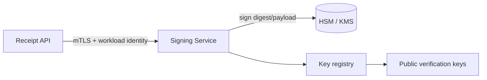

# Arquitectura de producción

## Diferencias con la PoC

NuProof Lab guarda una clave Ed25519 en un PEM local y usa SQLite para demostrar
el flujo sin cloud ni servicios externos. Esta simplificación hace la demo
reproducible, pero el servidor tiene acceso directo al material privado y la
auditoría no es inmutable. No es una arquitectura aceptable para un banco.

## Firma

El signing service debe tener una identidad de workload dedicada, permisos
mínimos y ninguna operación de exportación de clave. HSM/KMS conserva el material
privado. `keyId`, periodo de validez y estado de revocación viven en un registro
versionado. La rotación mantiene claves públicas históricas para verificar
comprobantes antiguos.

## Plataforma y acceso

- IAM con least privilege, separación de funciones y acceso just-in-time.
- OAuth2/OIDC para clientes, autorización por scopes y mTLS entre servicios.
- Secrets manager para credenciales no criptográficas.
- WAF, API gateway y rate limiting distribuido con protección anti-DDoS.
- Segmentación de red; el emisor interno no comparte superficie con verificación.
- Validación de esquema, límites de tamaño, idempotency keys y antifraude.

## Datos y auditoría

- Base de datos altamente disponible con cifrado, backups verificados y controles
  de integridad.
- Audit logs append-only enviados a almacenamiento inmutable y SIEM.
- Correlación mediante IDs no sensibles, alertas de abuso y retención definida.
- Privacidad por diseño, clasificación de datos y políticas de acceso.

## Operación

- Distributed tracing sin tokens ni PII, métricas y logs estructurados.
- Alta disponibilidad multi-zona, disaster recovery probado y objetivos RTO/RPO.
- Gestión de vulnerabilidades, SBOM, firma de artefactos y despliegue gradual.
- Runbooks para compromiso de clave: revocación, rotación, investigación y
  comunicación.

## Verificación independiente

La verificación pública podría validar la firma localmente con claves públicas
cacheadas, pero seguiría consultando el core para conocer el estado actual. Las
respuestas deben ser firmadas o servidas por canales autenticados y protegerse
contra downgrade de `version` y `keyId`.

